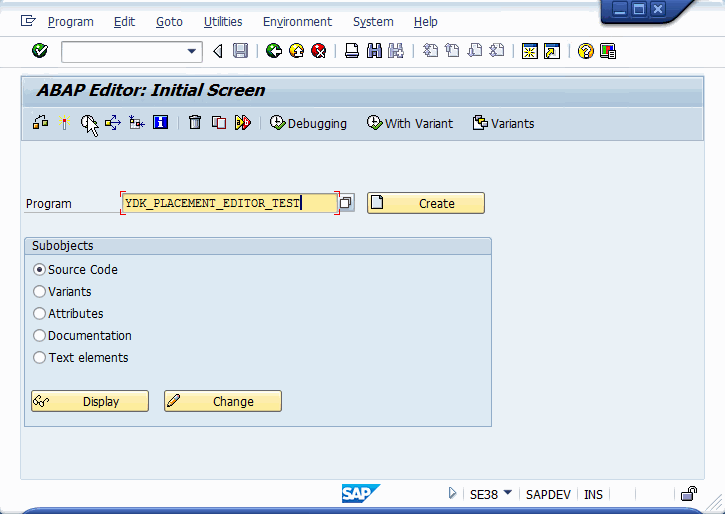

## Setting the location of the containers on the screen
The ydk_cl_placement class allows: 
* configure the location of containers on the screen
* save and restore the container sizes exposed by the user

There is a demo program [YDK_PLACEMENT_EDITOR_TEST](src/ydk_placement_editor_test.prog.abap), demonstrating all features of the class

To install this on SAP server, use [abapGit](https://docs.abapgit.org/)

