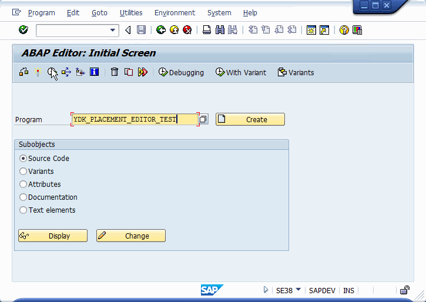
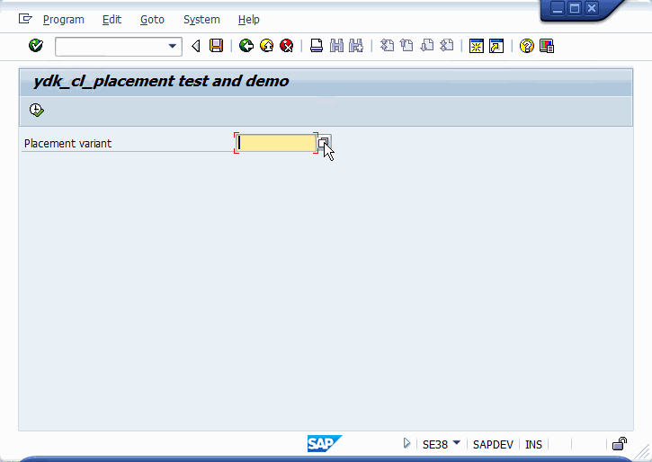

## Нстройка расположения контейнеров на экране
Класс ydk_cl_placement позволяет: 
* настроить расположение контейнеров на экране
* сохранять и востанавливать выставленные пользвателем размеры контейнеров

Есть демо программа [YDK_PLACEMENT_EDITOR_TEST](src/ydk_placement_editor_test.prog.abap), демонстрирующа все возможности класса

Для установки этого на SAP сервер используйте [abapGit](https://docs.abapgit.org/)

